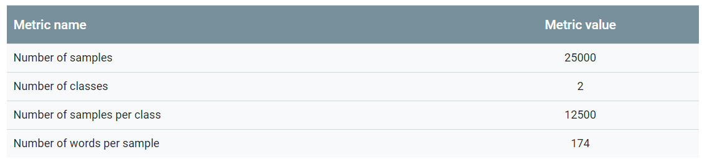

# 步骤2:数据探索
构建和培训模型只是工作流程的一部分。 事先了解数据的特征将使您能够构建更好的模型。 这可能只是意味着获得更高的准确性。 它还可能意味着需要更少的数据用于培训或更少的计算资源。

## 加载数据
首先，让我们将数据集加载到Python中。
```ptyhon
def load_imdb_sentiment_analysis_dataset(data_path, seed=123):
    """Loads the IMDb movie reviews sentiment analysis dataset.

    # Arguments
        data_path: string, path to the data directory.
        seed: int, seed for randomizer.

    # Returns
        A tuple of training and validation data.
        Number of training samples: 25000
        Number of test samples: 25000
        Number of categories: 2 (0 - negative, 1 - positive)

    # References
        Mass et al., http://www.aclweb.org/anthology/P11-1015

        Download and uncompress archive from:
        http://ai.stanford.edu/~amaas/data/sentiment/aclImdb_v1.tar.gz
    """
    imdb_data_path = os.path.join(data_path, 'aclImdb')

    # Load the training data
    train_texts = []
    train_labels = []
    for category in ['pos', 'neg']:
        train_path = os.path.join(imdb_data_path, 'train', category)
        for fname in sorted(os.listdir(train_path)):
            if fname.endswith('.txt'):
                with open(os.path.join(train_path, fname)) as f:
                    train_texts.append(f.read())
                train_labels.append(0 if category == 'neg' else 1)

    # Load the validation data.
    test_texts = []
    test_labels = []
    for category in ['pos', 'neg']:
        test_path = os.path.join(imdb_data_path, 'test', category)
        for fname in sorted(os.listdir(test_path)):
            if fname.endswith('.txt'):
                with open(os.path.join(test_path, fname)) as f:
                    test_texts.append(f.read())
                test_labels.append(0 if category == 'neg' else 1)

    # Shuffle the training data and labels.
    random.seed(seed)
    random.shuffle(train_texts)
    random.seed(seed)
    random.shuffle(train_labels)

    return ((train_texts, np.array(train_labels)),
            (test_texts, np.array(test_labels)))
```
### 检查数据
加载数据后，最好对其进行一些检查：选择一些样本并手动检查它们是否符合您的预期。 例如，打印一些随机样本以查看情绪标签是否与评论的情绪相对应。 以下是我们从IMDb数据集中随机选取的评论：“十分钟的故事延伸到两小时的大部分时间。 如果在中途发生任何重要的事情我都应该离开。“预期的情绪（负面）与样本的标签相匹配。

### 收集关键指标
验证数据后，请收集以下有助于表征文本分类问题的重要指标：

* 样本数：数据中的示例总数。

* 类别数量：数据中的主题或类别总数。

* 每个类的样本数：每个类的样本数（主题/类别）。 在平衡数据集中，所有类都具有相似数量的样本; 在不平衡的数据集中，每个类中的样本数量会有很大差异。

* 每个样本的单词数：一个样本中的单词中位数。

* 单词的频率分布：分布显示数据集中每个单词的频率（出现次数）。

* 样本长度分布：分布显示数据集中每个样本的单词数。
让我们看看这些指标的值对于IMDb评论数据集是什么（有关字频和样本长度分布的图，请参见图3和图4）。


### 表1：IMDb审查数据集指标
explore_data.py包含用于计算和分析这些指标的函数。 以下是几个例子：
```python
import numpy as np
import matplotlib.pyplot as plt

def get_num_words_per_sample(sample_texts):
    """Returns the median number of words per sample given corpus.

    # Arguments
        sample_texts: list, sample texts.

    # Returns
        int, median number of words per sample.
    """
    num_words = [len(s.split()) for s in sample_texts]
    return np.median(num_words)

def plot_sample_length_distribution(sample_texts):
    """Plots the sample length distribution.

    # Arguments
        samples_texts: list, sample texts.
    """
    plt.hist([len(s) for s in sample_texts], 50)
    plt.xlabel('Length of a sample')
    plt.ylabel('Number of samples')
    plt.title('Sample length distribution')
    plt.show()
```

### 图3：IMDb的字的频率分布
