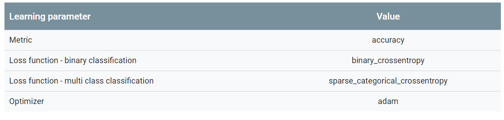
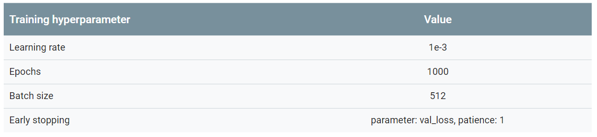

# 第4步：构建，培训和评估您的模型
在本节中，我们将致力于构建，培训和评估我们的模型。 在第3步中，我们选择使用n-gram模型或序列模型，使用我们的S / W比率。 现在，是时候编写我们的分类算法并对其进行训练。 我们将使用TensorFlow与tf.keras API进行此操作。

使用Keras构建机器学习模型就是将层，数据处理构建块组装在一起，就像我们组装乐高积木一样。 这些层允许我们指定要对输入执行的转换序列。 由于我们的学习算法采用单个文本输入并输出单个分类，因此我们可以使用Sequential模型API创建线性图层堆栈。


#### 图9：线性堆叠层

根据我们是构建n-gram还是序列模型，输入层和中间层的构造将不同。 但无论模型类型如何，最后一层对于给定问题都是相同的。
#### 构建最后一层
当我们只有2个类（二进制分类）时，我们的模型应输出单个概率分数。 例如，对于给定的输入样本输出0.2意味着“该样本在0级中的20％置信度，在类1中的80％。”为了输出这样的概率分数，最后一层的激活函数应该是 sigmoid函数，用于训练模型的损失函数应该是```二元交叉熵(binary cross-entropy )```（见图10，左）。

当有超过2个类（多类分类）时，我们的模型应该为每个类输出一个概率分数。 这些分数的总和应为1.例如，输出{0：0.2,1：0.7,2：0.1}意味着“该样本在0级中的20％置信度，在1级中的70％，以及10级 为了输出这些分数，最后一层的激活函数应该是softmax，用于训练模型的损失函数应该是```分类交叉熵(categorical cross-entropy)```。 （见图10，右）。

#### 图10：最后一层
下面的代码定义了一个函数，该函数将类的数量作为输入，并输出适当数量的层单元（1个单元用于二进制分类;否则每个类1个单元）和相应的激活函数：
```python
def _get_last_layer_units_and_activation(num_classes):
    """Gets the # units and activation function for the last network layer.

    # Arguments
        num_classes: int, number of classes.

    # Returns
        units, activation values.
    """
    if num_classes == 2:
        activation = 'sigmoid'
        units = 1
    else:
        activation = 'softmax'
        units = num_classes
    return units, activation
 ```
以下两节介绍了n-gram模型和序列模型的剩余模型层的创建。

当S / W比率很小时，我们发现n-gram模型比序列模型表现更好。 当存在大量小的密集向量时，序列模型更好。 这是因为在密集空间中学习嵌入关系，这在许多样本中都是最好的。

## 构建n-gram模型[选项A]
我们将独立处理token（不考虑词序）的模型称为n-gram模型。 简单的多层感知器（包括逻辑回归），GBDT和支持向量机模型都属于这一类; 他们无法利用任何有关文本排序的信息。

我们比较了上面提到的一些n-gram模型的性能，并观察到多层感知器（MLP）通常比其他选项表现更好。 MLP易于定义和理解，提供良好的准确性，并且需要相对较少的计算。

以下代码定义了tf.keras中的两层MLP模型，添加了几个Dropout层用于正则化（以防止过度拟合训练样本）。
```python
from tensorflow.python.keras import models
from tensorflow.python.keras.layers import Dense
from tensorflow.python.keras.layers import Dropout

def mlp_model(layers, units, dropout_rate, input_shape, num_classes):
    """Creates an instance of a multi-layer perceptron model.

    # Arguments
        layers: int, number of `Dense` layers in the model.
        units: int, output dimension of the layers.
        dropout_rate: float, percentage of input to drop at Dropout layers.
        input_shape: tuple, shape of input to the model.
        num_classes: int, number of output classes.

    # Returns
        An MLP model instance.
    """
    op_units, op_activation = _get_last_layer_units_and_activation(num_classes)
    model = models.Sequential()
    model.add(Dropout(rate=dropout_rate, input_shape=input_shape))

    for _ in range(layers-1):
        model.add(Dense(units=units, activation='relu'))
        model.add(Dropout(rate=dropout_rate))

    model.add(Dense(units=op_units, activation=op_activation))
    return model
 ```
    
## 构建序列模型[选项B]
我们将可以从token的邻接中学习的模型称为序列模型。这包括CNN和RNN类型的模型。数据被预处理为这些模型的序列向量。

序列模型通常具有大量要学习的参数。这些模型中的第一层是嵌入层，它学习密集向量空间中的单词之间的关系。学习单词关系最适合许多样本。

给定数据集中的单词很可能不是该数据集唯一的。因此，我们可以使用其他数据集来学习数据集中单词之间的关系。为此，我们可以将从另一个数据集中学习的嵌入转移到嵌入层中。这些嵌入被称为预训练嵌入。使用预先训练的嵌入使模型在学习过程中处于领先地位。

有预先训练好的嵌入可用大型语料库训练，如GloVe。 GloVe已经在多个语料库（主要是维基百科）上接受过训练。我们使用GloVe嵌入版本测试了我们的序列模型的训练，并观察到如果我们冻结预训练嵌入的权重并仅训练网络的其余部分，则模型表现不佳。这可能是因为嵌入层被训练的上下文可能与我们使用它的上下文不同。

在维基百科数据上训练的GloVe嵌入可能与我们的IMDb数据集中的语言模式不一致。 推断的关系可能需要一些更新 - 即，嵌入权重可能需要上下文调整。 我们分两个阶段完成：

1.在第一次运行中，嵌入层权重被冻结，我们允许网络的其余部分学习。 在此运行结束时，模型权重达到比未初始化值更好的状态。 对于第二次运行，我们允许嵌入层也学习，对网络中的所有权重进行微调。 我们将此过程称为使用微调嵌入。

2.微调嵌入可以提高精度。 然而，这是以增加训练网络所需的计算能力为代价的。 给定足够数量的样本，我们也可以从头开始学习嵌入。 我们观察到，对于S / W> 15K，从头开始有效地产生与使用微调嵌入相同的精度。

我们比较了不同的序列模型，如CNN，sepCNN（深度可分离卷积网络），RNN（LSTM和GRU），CNN-RNN和堆叠RNN，改变了模型架构。 我们发现sepCNNs是一种卷积网络变体，通常更具数据效率和计算效率，其性能优于其他模型。

> 注意：RNN仅与一小部分用例相关。 我们没有尝试使用具有注意力的QRNN或RNN等模型，因为它们的准确性改进将被更高的计算成本所抵消。```

以下代码构造了一个四层sepCNN模型：
```python
from tensorflow.python.keras import models
from tensorflow.python.keras import initializers
from tensorflow.python.keras import regularizers

from tensorflow.python.keras.layers import Dense
from tensorflow.python.keras.layers import Dropout
from tensorflow.python.keras.layers import Embedding
from tensorflow.python.keras.layers import SeparableConv1D
from tensorflow.python.keras.layers import MaxPooling1D
from tensorflow.python.keras.layers import GlobalAveragePooling1D

def sepcnn_model(blocks,
                 filters,
                 kernel_size,
                 embedding_dim,
                 dropout_rate,
                 pool_size,
                 input_shape,
                 num_classes,
                 num_features,
                 use_pretrained_embedding=False,
                 is_embedding_trainable=False,
                 embedding_matrix=None):
    """Creates an instance of a separable CNN model.

    # Arguments
        blocks: int, number of pairs of sepCNN and pooling blocks in the model.
        filters: int, output dimension of the layers.
        kernel_size: int, length of the convolution window.
        embedding_dim: int, dimension of the embedding vectors.
        dropout_rate: float, percentage of input to drop at Dropout layers.
        pool_size: int, factor by which to downscale input at MaxPooling layer.
        input_shape: tuple, shape of input to the model.
        num_classes: int, number of output classes.
        num_features: int, number of words (embedding input dimension).
        use_pretrained_embedding: bool, true if pre-trained embedding is on.
        is_embedding_trainable: bool, true if embedding layer is trainable.
        embedding_matrix: dict, dictionary with embedding coefficients.

    # Returns
        A sepCNN model instance.
    """
    op_units, op_activation = _get_last_layer_units_and_activation(num_classes)
    model = models.Sequential()

    # Add embedding layer. If pre-trained embedding is used add weights to the
    # embeddings layer and set trainable to input is_embedding_trainable flag.
    if use_pretrained_embedding:
        model.add(Embedding(input_dim=num_features,
                            output_dim=embedding_dim,
                            input_length=input_shape[0],
                            weights=[embedding_matrix],
                            trainable=is_embedding_trainable))
    else:
        model.add(Embedding(input_dim=num_features,
                            output_dim=embedding_dim,
                            input_length=input_shape[0]))

    for _ in range(blocks-1):
        model.add(Dropout(rate=dropout_rate))
        model.add(SeparableConv1D(filters=filters,
                                  kernel_size=kernel_size,
                                  activation='relu',
                                  bias_initializer='random_uniform',
                                  depthwise_initializer='random_uniform',
                                  padding='same'))
        model.add(SeparableConv1D(filters=filters,
                                  kernel_size=kernel_size,
                                  activation='relu',
                                  bias_initializer='random_uniform',
                                  depthwise_initializer='random_uniform',
                                  padding='same'))
        model.add(MaxPooling1D(pool_size=pool_size))

    model.add(SeparableConv1D(filters=filters * 2,
                              kernel_size=kernel_size,
                              activation='relu',
                              bias_initializer='random_uniform',
                              depthwise_initializer='random_uniform',
                              padding='same'))
    model.add(SeparableConv1D(filters=filters * 2,
                              kernel_size=kernel_size,
                              activation='relu',
                              bias_initializer='random_uniform',
                              depthwise_initializer='random_uniform',
                              padding='same'))
    model.add(GlobalAveragePooling1D())
    model.add(Dropout(rate=dropout_rate))
    model.add(Dense(op_units, activation=op_activation))
    return model
```

## 训练你的模型
现在我们已经构建了模型架构，我们需要训练模型。 训练涉及基于模型的当前状态进行预测，计算预测的不正确程度，以及更新网络的权重或参数以最小化该误差并使模型更好地预测。 我们重复这个过程，直到我们的模型融合并且无法再学习。 该过程有三个关键参数（见表2）。

1.指标：如何使用指标衡量模型的性能。 我们在实验中使用精度作为度量标准。
2.损失函数：用于计算损失值的函数，训练过程然后通过调整网络权重来尝试最小化该损失值。 对于分类问题，交叉熵损失效果很好。
3.优化器：一种函数，用于根据损失函数的输出决定如何更新网络权重。 我们在实验中使用了流行的Adam优化器。

在Keras中，我们可以使用compile方法将这些学习参数传递给模型。

#### 表2：学习参数

实际训练使用拟合方法进行。 根据数据集的大小，这是大多数计算周期将花费的方法。 在每次训练迭代中，使用来自训练数据的batch_size样本数来计算损失，并根据此值更新权重一次。 一旦模型看到整个训练数据集，训练过程就完成了一个epoch。 在每个epoch结束时，我们使用验证数据集来评估模型的学习效果。 我们使用数据集重复训练预定数量的时期。 我们可以通过early stopping来优化这一点，当验证准确度在连续时期之间稳定时，表明模型不再训练。

#### 表3：训练超参数

以下Keras代码使用上面表2和表3中选择的参数实现了训练过程：
```python
def train_ngram_model(data,
                      learning_rate=1e-3,
                      epochs=1000,
                      batch_size=128,
                      layers=2,
                      units=64,
                      dropout_rate=0.2):
    """Trains n-gram model on the given dataset.

    # Arguments
        data: tuples of training and test texts and labels.
        learning_rate: float, learning rate for training model.
        epochs: int, number of epochs.
        batch_size: int, number of samples per batch.
        layers: int, number of `Dense` layers in the model.
        units: int, output dimension of Dense layers in the model.
        dropout_rate: float: percentage of input to drop at Dropout layers.

    # Raises
        ValueError: If validation data has label values which were not seen
            in the training data.
    """
    # Get the data.
    (train_texts, train_labels), (val_texts, val_labels) = data

    # Verify that validation labels are in the same range as training labels.
    num_classes = explore_data.get_num_classes(train_labels)
    unexpected_labels = [v for v in val_labels if v not in range(num_classes)]
    if len(unexpected_labels):
        raise ValueError('Unexpected label values found in the validation set:'
                         ' {unexpected_labels}. Please make sure that the '
                         'labels in the validation set are in the same range '
                         'as training labels.'.format(
                             unexpected_labels=unexpected_labels))

    # Vectorize texts.
    x_train, x_val = vectorize_data.ngram_vectorize(
        train_texts, train_labels, val_texts)

    # Create model instance.
    model = build_model.mlp_model(layers=layers,
                                  units=units,
                                  dropout_rate=dropout_rate,
                                  input_shape=x_train.shape[1:],
                                  num_classes=num_classes)

    # Compile model with learning parameters.
    if num_classes == 2:
        loss = 'binary_crossentropy'
    else:
        loss = 'sparse_categorical_crossentropy'
    optimizer = tf.keras.optimizers.Adam(lr=learning_rate)
    model.compile(optimizer=optimizer, loss=loss, metrics=['acc'])

    # Create callback for early stopping on validation loss. If the loss does
    # not decrease in two consecutive tries, stop training.
    callbacks = [tf.keras.callbacks.EarlyStopping(
        monitor='val_loss', patience=2)]

    # Train and validate model.
    history = model.fit(
            x_train,
            train_labels,
            epochs=epochs,
            callbacks=callbacks,
            validation_data=(x_val, val_labels),
            verbose=2,  # Logs once per epoch.
            batch_size=batch_size)

    # Print results.
    history = history.history
    print('Validation accuracy: {acc}, loss: {loss}'.format(
            acc=history['val_acc'][-1], loss=history['val_loss'][-1]))

    # Save model.
    model.save('IMDb_mlp_model.h5')
    return history['val_acc'][-1], history['val_loss'][-1]
```

